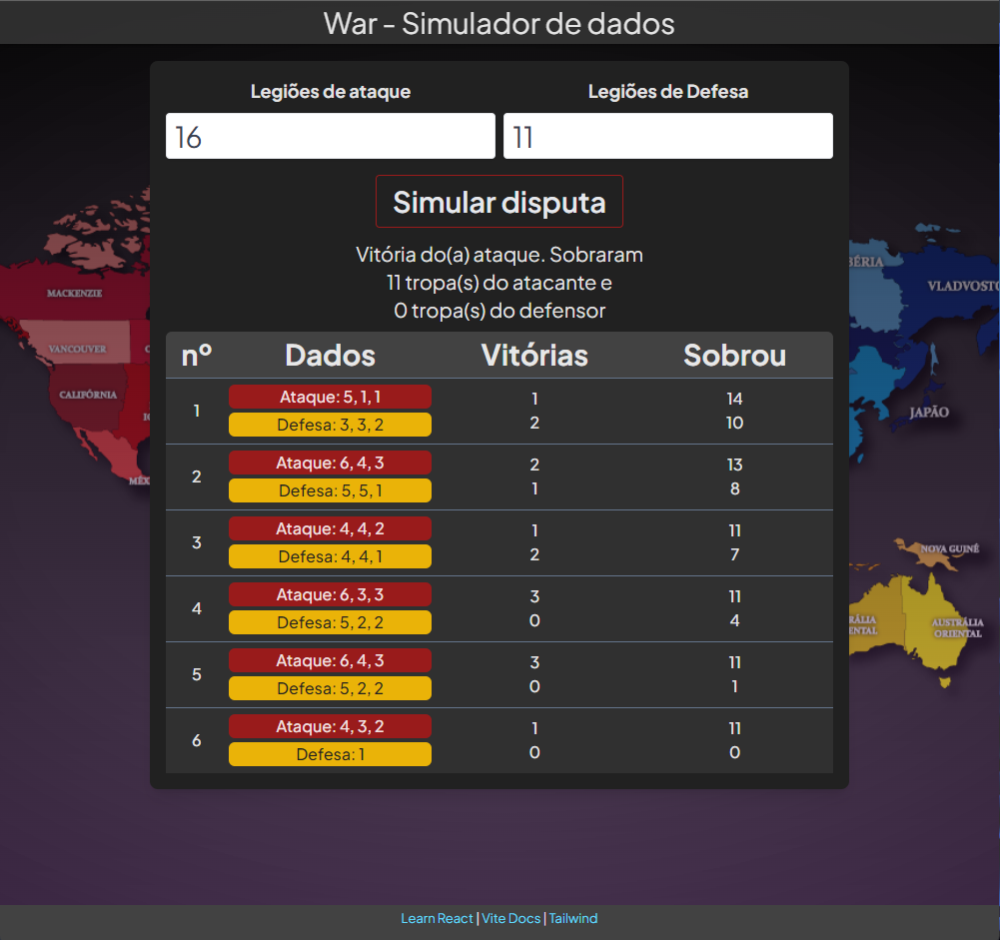

# Project to simulate dices for the game War
## Problem to solve

In some moments of the game, we have a huge amount of troops between attack and defense,
when this occurs, players have to roll their dice multiple times until someone wins.
Thinking about these cases, the simulator speeds up the game.
It can also be used when we lost that dices.

## How to start this project
```
1. fork
2. Access project folder then run ->
3. yarn install
4. yarn dev
```
**ps. : You need to have a node installed and add yarn to it.** 

## Application view



## Next steps
1. Add atack stop decision
2. Add translations

<br />
<hr />

### References:
####  Vite: https://vitejs.dev/ 

####  ReactTS: https://www.typescriptlang.org/pt/docs/handbook/react.html
####  Tailwind: https://v2.tailwindcss.com/docs
